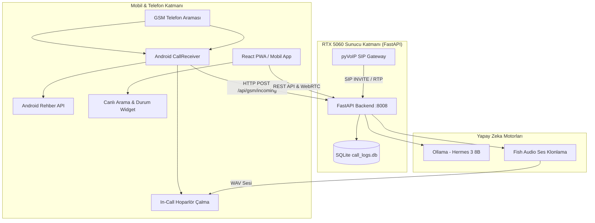

# 🎙️ TENRA — Kişisel AI Ses İkizi ve Akıllı Telefon Sekreteri

> **Ahmet Eren Yıldız'ın Yapay Zeka Ses İkizi & Otonom Telefon Asistanı**  
> NVIDIA GeForce RTX 5060 üzerinde yerel LLM (Ollama) ve Fish Audio ses klonlama teknolojisiyle çalışan; gelen aramaları otomatik yanıtlayan, arayan kişiyi rehberden tanıyan, diyalog kurup not alan ve özetleyen tam teşekküllü yapay zeka ekosistemi.

---

## 🚀 Öne Çıkan Özellikler

- 🧠 **Akıllı Durum Modları (9 Preset + Serbest Not):**
  - *Okulda, Sporda, Toplantıda, Müsait, Yemekte, Uykuda, Trafikte, Dışarıda, Ders.*
  - **✏️ Özel Not Modu:** Kullanıcı serbestçe not bırakır (örn: *"Şu an veznedeyim, çıkışında müsaitim"*), yapay zeka bu notu arayana doğal, samimi ve akıllı bir dille özetler.
- 📇 **Android Rehber Çözümleme (`ContactsContract.PhoneLookup`):**
  - Gelen aramalarda sadece numarayı değil, telefon rehberindeki ismi (**"Oğuz"**, **"Annem"**, vb.) anında tespit eder ve kişiye ismiyle hitap eder.
- 🔊 **Çift Motorlu Çağrı Cevaplama (Dual-Engine):**
  - Android 10-15 güvenlik kısıtlamalarını aşmak için `TelecomManager` + evrensel kulaklık donanım sinyali (`KEYCODE_HEADSETHOOK`) ile 10 saniye sonra otomatik açılır ve hoparlörden konuşur.
- 🌐 **Kurumsal VoIP / SIP Santral Gateway (`pyVoIP`):**
  - NetGSM, Bulutfon, Zadarma veya yerel PBX santrallerine SIP dahili olarak bağlanır; G.711 / RTP ses akışıyla aramaları doğrudan sunucuda karşılar.
  - Twilio Voice ve Bulut santraller için TwiML / Voice XML Webhook desteği (`/api/voip/webhook`).
- 📝 **Akıllı Sekreter & Özetleme:**
  - Görüşme bittiğinde arayanın amacını, sorduğu soruları ve aciliyet derecesini (*önemli, normal, öylesine*) analiz edip SQLite veritabanına ve bildirim paneline kaydeder.
- ⚡ **RTX 5060 Donanım Optimizasyonu:**
  - Ollama `hermes3:8b` modeli GPU VRAM'inde milisaniyelik gecikmeyle çalışır.
  - Sunucu çökme koruması ve otomatik yeniden başlatma (`baslat_tenra.bat`).

---

## 🏗️ Sistem Mimarisi



---

## 📂 Proje Dizin Yapısı

```text
tenra/
├── server/                 # FastAPI Backend (REST API, PWA Statik Servis, Webhooklar)
│   ├── api.py              # Ana API sunucusu (Port 8008)
│   ├── requirements.txt    # Python bağımlılıkları
│   └── pwa/                # PWA statik dosyaları
├── tenra-mobile/           # Modern React + TypeScript + Vite + Capacitor Mobil Uygulaması
│   ├── src/                # Bileşenler (StatusWidget, LiveCallBridge, SettingsModal, vb.)
│   ├── android/            # Yerel Android Studio projesi (CallReceiver.java, MainActivity.java)
│   └── dist/               # Derlenmiş üretim web varlıkları
├── voice_twin/             # Ses İkizi ve Diyalog Motoru
│   ├── call_agent.py       # Ollama diyalog ajanı ve akıllı özetleyici
│   ├── tts_engine.py       # Fish Audio, ElevenLabs & Yerel RVC ses sentezleyici
│   ├── rvc_bridge.py       # Yerel RVC v2 inference köprüsü (Applio entegrasyonu)
│   ├── sip_gateway.py      # pyVoIP tabanlı SIP / Telefon Santrali motoru
│   └── call_logs_db.py     # SQLite veritabanı CRUD operasyonları
├── saas_engine/            # Dijital İkiz ve SaaS Otomasyon Motoru
│   ├── saas_pipeline.py    # WhatsApp sohbet dökümünden LoRA veri seti & RAG anı çıkarıcı
│   ├── export_lora_gguf.py # LoRA ağırlıklarını Ollama GGUF formatına dönüştürücü
│   └── retrain_pipeline.py # 250 Epoch yerel model yeniden eğitim hattı
├── baslat_tenra.bat        # Sunucuyu otomatik restart ve healthcheck ile başlatan betik
├── derle_ve_yayinla.bat    # React derleme ve sunucu güncelleme betiği
├── call_logs.db            # Arama kayıtları, notlar ve asistan ayarları veritabanı
└── README.md               # Proje dokümantasyonu
```

---

## 🗺️ SaaS Vizyonu & Yerel Ses İkizi Yol Haritası (Roadmap)

> **Hedef:** Harici API maliyetlerine (Fish Audio, ElevenLabs) bağımlı kalmadan; tamamen yerel GPU (RTX 5060) ve bulut konteynerleri üzerinde çalışan, sıfır marjinal maliyetli bağımsız bir SaaS ekosistemi inşa etmek.

### 📌 Faz 1: Hibrit MVP (Şu Anki Durum - Aktif)
- **Hızlı Prototip & Doğrulama:** Fish Audio API + Ollama `hermes3:8b` + Web Speech API + Android Dual-Engine Call Receiver.
- **Kişiye Özel Yanıt:** 9 hazır durum modu + Serbest Özel Not analizi.
- **Çağrı Santrali:** pyVoIP SIP Gateway ve Bulut Webhook altyapısı.

### 📌 Faz 2: Tamamen Yerel ve Bağımsız RVC Motoruna Geçiş
- **Sıfır API Bağımlılığı:** Harici TTS servisleri yerine, `C:\Applio\assets\weights\ahmet_eren_v2.pth` ve Faiss `.index` ağırlıklarının `rvc_bridge.py` üzerinden devreye alınması.
- **Maliyet Avantajı:** Karakter ve dakika başına API ücreti ödemeden, RTX 5060 donanımında sınırsız yerel ses sentezi.
- **Ultra Düşük Gecikme:** Yerel inference ile internet dalgalanmalarından etkilenmeyen diyalog akışı.

### 📌 Faz 3: Otomatik SaaS Klonlama Motoru (`saas_engine/`)
- **Tek Tıkla Dijital İkiz:** `saas_pipeline.py` kullanılarak müşterilerin WhatsApp sohbet yedeklerinden (`.txt`) ve 3 dakikalık ses kaydından:
  1. Kişilik & tonlama analizi yapılması,
  2. Soru-cevap LoRA eğitim veri setinin otomatik çıkarılması,
  3. Kişiye özel Ollama Modelfile ve RAG hafıza dosyasının üretilmesi,
  4. 5 dakika içinde müşteriye özel telefon sekreteri ve ses ikizinin ayağa kaldırılması.

### 📌 Faz 4: Kurumsal Model Depolama ve Mimari
- **Büyük Veri & Model Ayrımı:** Gigabaytlarca eğitim verisi (`master_veriseti.jsonl`) ve model ağırlıkları (`.pth`, `.gguf`) Git reposunu şişirmemek ve gizliliği korumak için S3 / Cloudflare R2 / Hugging Face Private Hub üzerinde barındırılır.
- **Hafif ve Dağıtılabilir Repo:** Git reposunda sadece saf mühendislik kodları ve boru hatları (pipeline) tutulur; yeni sunuculara saniyeler içinde `git clone` ile dağıtım yapılır.

---

## 🛠️ Kurulum ve Çalıştırma

### Gereksinimler
- **İşletim Sistemi:** Windows 10/11
- **GPU:** NVIDIA RTX Serisi (Örn: RTX 5060 Laptop GPU, 8GB VRAM)
- **Python:** 3.11+
- **Node.js:** 18+
- **Ollama:** `ollama run hermes3:8b` kurulu ve çalışır durumda

### 1. Sunucuyu Başlatma
Sunucuyu tüm servisleriyle tek tıkla ayağa kaldırmak için:
```cmd
baslat_tenra.bat
```
Bu script sırasıyla:
1. Ollama motorunu kontrol eder, kapalıysa başlatır.
2. Cloudflare HTTPS tünelini kontrol eder.
3. FastAPI sunucusunu `http://0.0.0.0:8008` üzerinde otomatik restart korumasıyla çalıştırır.

### 2. Arayüzü Derleme ve Güncelleme
React arayüzünde yapılan değişiklikleri derleyip sunucuya aktarmak için:
```cmd
derle_ve_yayinla.bat
```

### 3. Mobil Uygulamaya Erişim
- **Ev İçi Wi-Fi:** `http://192.168.1.100:8008/mobile/`
- **Tailscale VPN (Dışarıdan):** `http://100.93.198.21:8008/mobile/`
- **Cloudflare Tüneli:** `https://[tunel-adiniz].trycloudflare.com/mobile/`

---

## 🔒 Güvenlik ve Gizlilik
- Tüm görüşme dökümleri ve özetler yerel SQLite veritabanında (`call_logs.db`) tutulur.
- LLM model inferansı (Ollama) yerel GPU donanımı (RTX 5060) üzerinde tamamen internetsiz/offline çalışır.
- Hassas API anahtarları ve ses modelleri `.gitignore` ile korunmaktadır.

---

## 📄 Lisans
Bu proje kişisel kullanım ve geliştirme amacıyla tasarlanmıştır. Tüm hakları Ahmet Eren Yıldız'a aittir.
